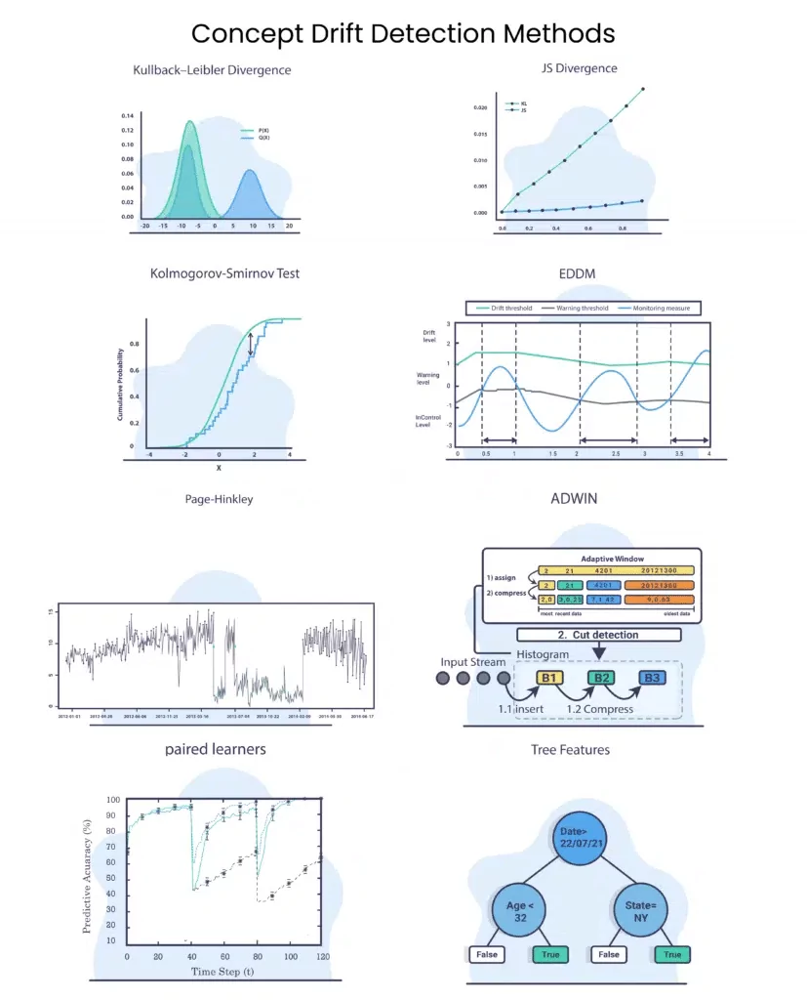

# Détection de dérive dans les données de diabète


                                          |

Ce projet utilise un modèle de régression logistique pour détecter la dérive des données dans un ensemble de données de diabète. Il introduit artificiellement de la dérive dans les données pour simuler un environnement de données changeantes et surveiller les performances du modèle au fil du temps. Le projet inclut également des visualisations et des mesures de performance pour évaluer l'impact de la dérive sur le modèle.

# Rappel : 
| Concept   | Définition                                                                                                                         | Exemple                                                                                                                          |
|-----------|-------------------------------------------------------------------------------------------------------------------------------------|----------------------------------------------------------------------------------------------------------------------------------|
| Accuracy  | La proportion de diagnostics corrects parmi tous les diagnostics effectués.                                                        | Si tu diagnostiques correctement 90 patients sur 100, ton accuracy est de 90%.                                                   |
| Precision | La proportion de vrais positifs (diagnostics corrects de la maladie) parmi tous les diagnostics positifs (diagnostics de la maladie). | Si tu diagnostiques 30 patients comme malades et 25 d'entre eux le sont vraiment, ta précision est de 83.3%.                    |
| Recall    | La proportion de vrais positifs parmi tous les vrais cas (patients réellement malades).                                               | Si 40 patients sont réellement malades et tu diagnostiques correctement 25 d'entre eux, ton rappel est de 62.5%.                  |
| F1 Score  | La moyenne harmonique de la précision et du rappel.                                                                                  | Si ta précision est de 83.3% et ton rappel est de 62.5%, ton F1 score est de 71.4%.   

## Fonctionnalités

- **Introduction de Dérive** : Simule la dérive des données en modifiant les valeurs de certaines caractéristiques (Glucose et BMI) avec une probabilité donnée.
- **Ingestion de Données avec Dérive** : Fournit un flux de données continu avec dérive pour tester la robustesse du modèle.
- **Détection de Dérive** : Utilise le test Kolmogorov-Smirnov pour détecter la dérive des données.
- **Notification et Recommandations** : Informe l'utilisateur en cas de détection de dérive et fournit des recommandations pour mettre à jour le modèle.
- **Suivi de la Distribution des Diabétiques** : Visualise la proportion de personnes diabétiques au fil du temps.
- **Entraînement et Réentraînement du Modèle** : Entraîne initialement un modèle de régression logistique et le réentraîne avec de nouvelles données en continu.
- **Sauvegarde des Données et Métriques** : Enregistre les données avec dérive et les métriques de performance du modèle dans des fichiers CSV.

## Prérequis

Assurez-vous d'avoir les bibliothèques suivantes installées :

- pandas
- scikit-learn
- scipy
- matplotlib
- numpy

Vous pouvez installer ces bibliothèques avec pip :

```bash
pip install pandas scikit-learn scipy matplotlib numpy
```

## Contribuer
Les contributions sont les bienvenues. Pour contribuer, veuillez suivre les étapes ci-dessous :

- Fork ce dépôt.
- Créez une nouvelle branche pour vos modifications (git checkout -b feature/nom-de-la-branche).
- Effectuez vos modifications et testez-les.
- Commitez vos modifications (git commit -am 'Ajouter une nouvelle fonctionnalité').
- Poussez la branche (git push origin feature/nom-de-la-branche).
- Ouvrez une Pull Request.


## Auteurs

    Nom : Mohamed DIALLO
    email : mohameddiallo728@gmail.com

## Licence

Ce projet est sous licence MIT - voir le fichier [LICENSE](https://opensource.org/licenses/MIT) pour plus de détails.
